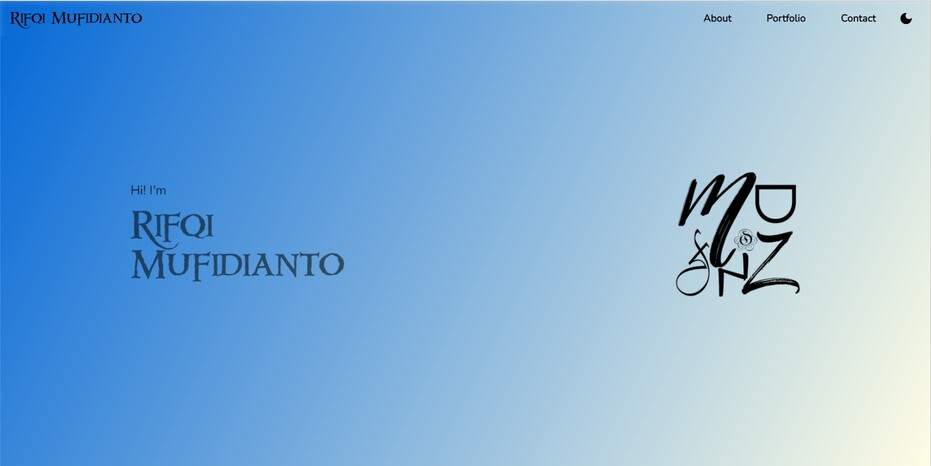

# Web Portfolio

This is my simple portfolio. Developed by me. Using [Flutter](https://flutter.dev/ "Flutter"). Data Source from [Firebase](https://firebase.google.com/ "Firebase"). And here is for the link [https://mufiidz.github.io](https://mufiidz.github.io "https://mufiidz.github.io").

## Library

1. [BLoc](https://pub.dev/packages/flutter_bloc) for State Management
2. [Dio](https://pub.dev/packages/dio) for HTTP Client
3. [Get_it](https://pub.dev/packages/get_it) for Dependency Injection
4. [Auto Route](https://pub.dev/packages/auto_route) for Routing 2.0
5. Used Material Design Components 3, ViewModel, and any more libraries.

## Database

- [Firebase](https://firebase.google.com/)

## Note

Dont forget to run generator. Use the [watch] flag to watch the files system for edits and rebuild as necessary.

```dart
flutter packages pub run build_runner watch
```

if you want the generator to run one time and exits use

```dart
flutter packages pub run build_runner build
```

---

Add Firebase Config

```dart
static FirebaseOptions get options => const FirebaseOptions(
      apiKey: "api_key",
      appId: "app_id",
      messagingSenderId: "messaging_sender_id",
      authDomain: "auth_domain",
      databaseURL: "database_url",
      storageBucket: "storage_bucket",
      projectId: "project_id");
```
and init firebase
```dart
await Firebase.initializeApp(options: FirebaseConfig.options);
```

## What's Next?

- Redesign UI
- Support Language (EN & ID)

## Screenshoots

### v1


### v2



To see my first version of my web portfolio, please goto branch [v1](https://github.com/Mufiidz/mufiidz.github.io/tree/v1).
